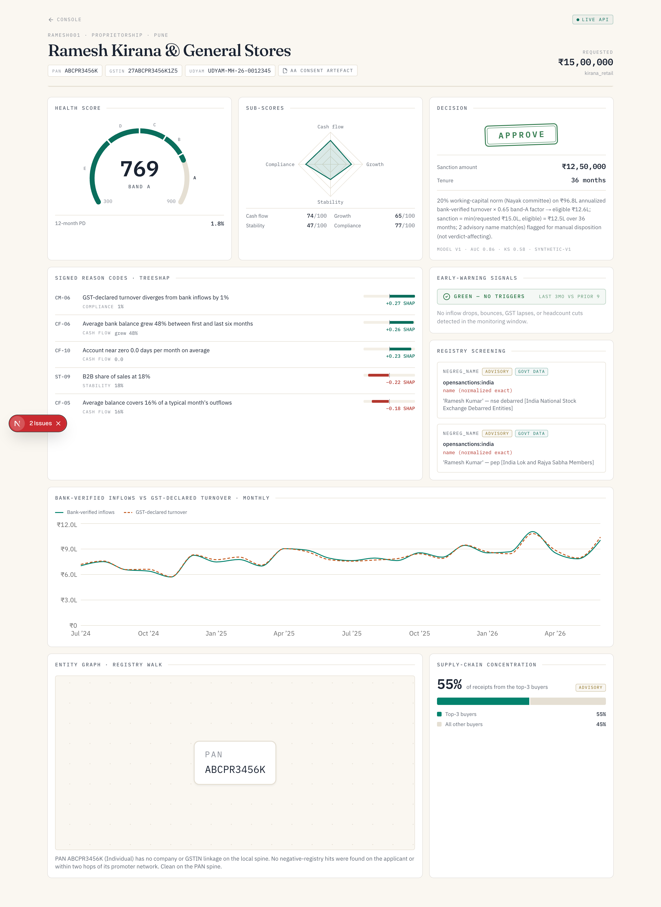
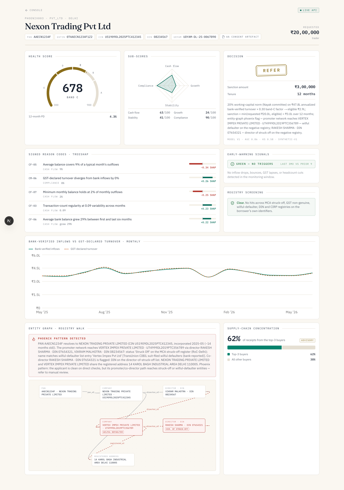

# SHROFF — MSME Financial Health Card

**Alternate-data credit decisioning for credit-invisible small businesses.**
Built for **IDBI Innovate 2026 · Track 03 — Financial Inclusion (Digital Lending)**.

Millions of Indian MSMEs — kirana stores, small traders, tiny manufacturers — are **new-to-credit** or run on cash/UPI and never kept formal books. Banks judge them on audited statements, ITR and a CIBIL score they simply don't have, so viable businesses get auto-rejected. Meanwhile some borrowers who *look* clean on paper are quietly failing, and get through. SHROFF reads a business's real, consented digital money-trail (GST, UPI/bank via Account Aggregator, EPFO) and tells the bank the truth **in both directions** — *approve the invisible-but-healthy* and *catch the looks-fine-but-failing* — so the loan book gets healthier, not just larger.

> **Why "Shroff"?** A *shroff* was the traditional Indian banker-moneychanger who, long before CIBIL, judged a merchant's creditworthiness by cash-flow, conduct and reputation — never by paperwork. This is a digital shroff: the same instinct, rebuilt from alternate data.

---

## What it does

Three deliberately different kinds of signal, combined into one auditable decision:

1. **Cash-flow health score** — a monotonic-constrained **LightGBM ensemble + TreeSHAP** over ~45 engineered signals (cash-flow buffers, inflow trend, bounce history, GST punctuality, GST-vs-bank divergence, buyer concentration, headcount), calibrated to a 12-month probability of default and scaled to a 300–900 score with four sub-scores (cash-flow · growth · stability · compliance). **No LLM is ever on the decision path.**
2. **Negative-registry + entity graph** — deterministic screening against **~45,000 real government-sourced rows** (MahaGST non-genuine taxpayers, SEBI/NSE debarred, CBDT defaulters, MCA struck-off, RBI/OpenSanctions watchlists), plus a **PAN-spine entity graph** that catches *phoenix* fraud: a spotless new company whose promoter's network reaches a struck-off / wilful-defaulter entity.
3. **Explainability & lending rail** — signed reason codes and a rupee-axis "bank-verified inflows vs GST-declared turnover" view, then the decision is emitted as an **OCEN 4.0-aligned loan offer** (risk-based pricing, EMI, tenure) ready for a Loan Agent to consume — via a `DataSourceAdapter` layer (Account Aggregator live-capable; ULI/OCEN adapter-ready).

### The console

| Approve (invisible-but-healthy) | Refer (phoenix promoter) |
|---|---|
|  |  |

The entity graph on the right walks a clean applicant's promoter to a struck-off, wilful-defaulter company two co-directors away — the score alone says *maybe*, the graph says *refer*.

---

## Results (untouched holdout, synthetic-v1)

| Metric | Value |
|---|---|
| Discrimination (AUC / KS) | **0.856 / 0.575** |
| Default rate by band | A **1.26%** → B 3.85% → C 4.36% → D 11.56% → E **37.42%** (monotone) |
| Approve bands A/B → bad-rate in approved book | **1.36%** vs 10.24% population (**7.6× cleaner**) |
| Defaults kept out of the approved book | **94.5%** |

> A full, reproducible proof/benchmark page is at [`docs/pipeline-proof.html`](docs/pipeline-proof.html). The training set is **synthetic** — it encodes known MSME risk economics, so the numbers demonstrate the *pipeline* (feature engine, monotone constraints, calibration, decisioning), not production performance. In production the model is retrained and recalibrated on the bank's own portfolio outcomes.

## Demo personas

| Persona | Story | Decision |
|---|---|---|
| **Ramesh Kirana** | No CIBIL, 24 months of clean bank + GST cash flow | **APPROVE** ₹12.5L @ 13.77% |
| **Suresh Trading** | Looks fine, but GST declared 37% above bank inflows, sliding receipts, bounces | **DECLINE** |
| **Nexon Trading** | Tidy thin file — promoter DIN walks to a struck-off shell at the same address | **REFER** (manual review) |

---

## Architecture

```
  Account Aggregator (GST + UPI/bank)          ┌── monotonic LightGBM x4 ─┐
  EPFO                       ── features(~45) ─┤   → meta → isotonic PD   ├─→ score 300–900
                                               └── TreeSHAP reason codes ─┘        │
  Negative registries (SQLite, ~45k real rows) ── screening + PAN entity graph ────┤ overlays
                                                                                    ▼
                                              decision (approve / refer / decline, amount, tenure)
                                                                                    │
                                              OCEN 4.0 loan offer  ── ULI/OCEN adapter-ready
```

- **Web** — Next.js (App Router, TypeScript) + Tailwind, Recharts, React Flow. `web/`
- **Scoring API** — Python 3.12 + FastAPI + LightGBM + SHAP + scikit-learn. `ml/`
- **Screening + graph** — stdlib SQLite registry + PAN-spine graph walk. `ml/screening/`
- The web console falls back to bundled fixtures if the API is unreachable, so the demo never breaks; a chip shows whether it's serving live or fixture data.

## Run it locally

See **[`RUN.md`](RUN.md)** for exact commands. In short:

```bash
# 1) scoring API  (http://localhost:8000)
cd ml && uv sync && uv run python -m datagen.generate && uv run python -m features.build \
      && uv run python -m train.train && uv run uvicorn api.main:app --port 8000

# 2) web console  (http://localhost:3000)
cd web && npm install && NEXT_PUBLIC_ML_API=http://localhost:8000 npm run dev
```

Then open `http://localhost:3000/console`. No API keys required — the optional LLM narrative is env-gated and off by default (nothing generative computes a number).

Tech-stack rationale: **[`STACK.md`](STACK.md)** · Plain-English problem walkthrough: **[`explain-3.txt`](explain-3.txt)**.

## Repository layout

```
ml/        scoring API, feature engine, model training, negative-registry screening + entity graph
web/        Next.js underwriter console
docs/       benchmark proof page + UI screenshots
given/      IDBI Innovate submission template
```

## License

MIT — see [`LICENSE`](LICENSE).
